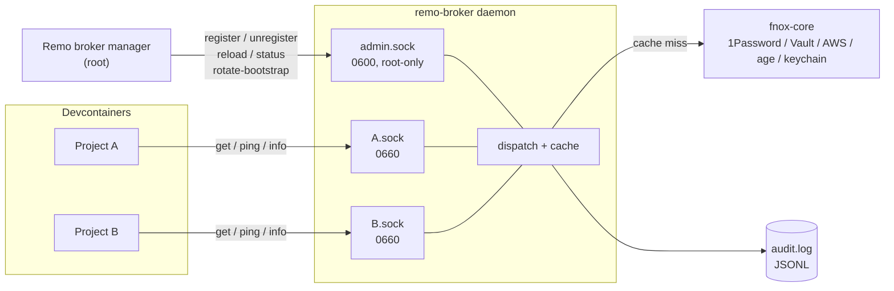

# remo-broker

[](https://github.com/get2knowio/remo-broker/actions/workflows/ci.yml)
[](LICENSE)

> On-instance credential broker daemon for [Remo](https://github.com/get2knowio/remo).

`remo-broker` is a long-lived Rust daemon that holds a per-instance bootstrap
token, authenticates upward to a credential backend via
[fnox-core](https://github.com/jdx/fnox), and serves per-project Unix sockets
enforcing per-project secret allowlists. It is the on-instance half of Remo's
credential-broker feature.

## Contents

- [Why does this exist?](#why-does-this-exist)
- [How it works](#how-it-works)
- [Quick start](#quick-start)
- [Status](#status)
- [Architecture notes](#architecture-notes)
- [Development](#development)
- [Security](#security)
- [Versioning](#versioning)
- [License](#license)

## Why does this exist?

Developer instances increasingly run untrusted code: npm/pip postinstall
scripts, MCP servers, LLM agents. Any long-lived credential sitting in
`~/.netrc`, `$GITHUB_TOKEN`, or `~/.aws/credentials` is reachable by all of
it, with no audit trail.

`remo-broker` removes those credentials from the instance. A successful
supply-chain attack on a devcontainer can recover at most the secrets that
project's manifest explicitly named, and every attempt — allowed or denied —
is recorded. Cross-project escalation through the broker is structurally
impossible: each socket is a separate file with its own allowlist.

## How it works



- **Admin socket** carries the control plane. Owned by root, mode `0600`. Driven by Remo's instance-side broker manager.
- **Project sockets** carry the data plane. One per registered project, mode `0660`, bind-mounted into the project's devcontainer.
- **Manifest** (`.devcontainer/remo-broker.toml` or `.remo/broker.toml`) declares the project's allowlist. Reloads swap the in-memory copy atomically.
- **Cache** is per-project, in-memory only, bounded by TTL and `max_entries`. Values stay wrapped in `secrecy::SecretString`; drop / eviction / unregister all zeroize.
- **Audit** is one append-only JSONL line per fetch, including denials. Values never reach audit events.

Wire protocol: [`docs/wire-protocol.md`](docs/wire-protocol.md).
Manifest schema: [`docs/manifest-schema.md`](docs/manifest-schema.md).

## Quick start

End-to-end "fetch a real secret" in a `/tmp` sandbox — no systemd, no root.
Requires `socat` (or `nc -U`) for talking to the sockets.

```bash
# 1. Build (Linux build deps are needed because fnox-core links hidapi → libudev)
sudo apt-get install -y pkg-config libudev-dev socat
cargo build --release

# 2. Sandbox
mkdir -p /tmp/rb/{run,log}
echo "dev-bootstrap-token" > /tmp/rb/bootstrap-token

# 3. Minimal fnox.toml — defines one inline plaintext secret named HELLO
cat > /tmp/rb/fnox.toml <<'EOF'
[providers]
plain = { type = "plain" }

[secrets]
HELLO = { provider = "plain", value = "world" }
EOF

# 4. A project that's allowed to fetch HELLO
mkdir -p /tmp/hello-project/.remo
cat > /tmp/hello-project/.remo/broker.toml <<'EOF'
schema_version = 1

[project]
name = "hello-project"

[allowlist]
secrets = ["HELLO"]
EOF

# 5. Start the daemon
./target/release/remo-broker \
  --bootstrap-token-path /tmp/rb/bootstrap-token \
  --fnox-config          /tmp/rb/fnox.toml \
  --socket-dir           /tmp/rb/run \
  --audit-log-path       /tmp/rb/log/audit.log &

# 6. Register the project
echo '{"op":"register","name":"hello-project","project_path":"/tmp/hello-project"}' \
  | socat - UNIX-CONNECT:/tmp/rb/run/admin.sock
# → {"ok":true,"socket_path":"/tmp/rb/run/hello-project.sock"}

# 7. Fetch the secret over the project socket
echo '{"op":"get","name":"HELLO"}' \
  | socat - UNIX-CONNECT:/tmp/rb/run/hello-project.sock
# → {"ok":true,"value":"world","ttl_seconds":900}

# 8. Verify the audit log captured the fetch (without the value)
tail -1 /tmp/rb/log/audit.log
# → {"event":"fetch","timestamp":"…","project":"hello-project","secret_name":"HELLO","decision":"allow","outcome":"ok","peer_pid":…,"peer_uid":…,"latency_ms":…,"backend":"fnox"}
```

For production use under systemd see [`packaging/README.md`](packaging/README.md):
unit file placement, sysusers / tmpfiles, bootstrap-token provisioning
(plaintext or TPM2-sealed via `LoadCredentialEncrypted=`), and troubleshooting.

Requires Rust **1.95** (pinned in `rust-toolchain.toml`).

## Status

Pre-release, no tagged versions yet. The implementation tracks
[`specs/001-broker-daemon/spec.md`](specs/001-broker-daemon/spec.md); see
the [dashboard tables](specs/001-broker-daemon/spec.md#implementation-status)
for current FR / NFR / SC status and the
[roadmap](specs/001-broker-daemon/spec.md#deferred-work-and-roadmap)
for what's queued next.

The broker daemon itself is feature-complete against the spec's functional
requirements; remaining work is verification (latency / RSS / binary-size
measurement, fuzz / soak / killtest / red-team harnesses), some operational
edges (project-socket group ownership, `peer_unexpected` policy), and shipping
artifacts (JSON Schema, `.deb`/`.rpm`).

## Architecture notes

The spec's
[Key Implementation Decisions](specs/001-broker-daemon/spec.md#key-implementation-decisions)
table is the non-obvious-decisions index — worth reading before changing
load-bearing modules. Example calls captured there: why `Project.manifest`
is `ArcSwap<Manifest>`; why `BackendSession` wraps `Arc<ArcSwap<Fnox>>`
(so `rotate-bootstrap` swaps without disturbing in-flight `get`s); why
audit emission happens *before* the response is serialized; why the IMDSv2
client is hand-rolled rather than pulling an HTTP-client crate; why six
RUSTSEC advisories are accepted with documented rationale in `deny.toml`.

Module map:

| Path | Role |
|---|---|
| `src/main.rs` | CLI binary; wires `Config` → `BackendSession` → `Server` |
| `src/config.rs` | `/etc/remo-broker/config.toml` parsing + CLI overrides |
| `src/bootstrap.rs` | Bootstrap-token resolver (file / env / IMDSv2) |
| `src/backend.rs` | fnox-core wrapper (`Arc<ArcSwap<Fnox>>`) |
| `src/manifest.rs` | Per-project `remo-broker.toml` parser |
| `src/registry.rs` | `ProjectRegistry` + per-project `Project` state |
| `src/cache.rs` | `BoundedCache` (per-project, zeroize-on-drop) |
| `src/audit.rs` | JSONL audit log + async writer + degraded-mode buffer |
| `src/proto/` | Wire-protocol request/response types |
| `src/server.rs` | Daemon harness + admin + project socket loops |
| `packaging/` | systemd unit + sysusers + tmpfiles + operator README |
| `docs/` | Wire protocol + manifest schema specs |
| `specs/001-broker-daemon/` | Canonical feature spec (the source of truth) |

## Development

```bash
cargo build --all-targets --all-features
cargo test
cargo fmt --check
cargo clippy --all-targets --all-features -- -D warnings
cargo deny check
```

CI runs all of the above on every push and PR, plus `systemd-analyze verify`
on the unit file. See [`.github/workflows/ci.yml`](.github/workflows/ci.yml).

### Testing conventions

- Tests live in `mod tests` inside each module under test. No separate
  integration-test directory (yet).
- Hand-rolled `TempDir` per module — avoids the `tempfile` crate dep.
- Env-mutating tests use per-test unique variable names; `std::env::set_var`
  is `unsafe` in edition 2024.
- Wire-protocol response tests compare serialized JSON to a `json!` literal
  copied verbatim from `docs/wire-protocol.md` — pins against silent serde
  drift.

## Security

- **No secret values in the audit log.** `FetchEvent` has no `value` field
  by construction; verified at runtime by the `audit_never_contains_secret_value`
  test (plants a tripwire string, drives a cache hit, greps the log).
- **Zeroize on drop.** Cached values are `secrecy::SecretString`; expiry,
  eviction, `unregister`, and daemon shutdown all trigger zeroization.
- **No backend round-trip on denial.** The allowlist check happens *before*
  cache lookup or backend call.
- **`rotate-bootstrap` is atomic at the read side.** In-flight `get` calls
  complete against the snapshot of `Fnox` they loaded; the next call sees
  the freshly-installed session. On failure the old session is retained.
- **Documented advisory exceptions.** `deny.toml` lists six accepted RUSTSEC
  advisories from fnox-core's AWS-SDK / hyper / rustls transitive deps,
  each with a per-entry rationale. Mirrored into the `rustsec/audit-check`
  action's `ignore` input so CI stays green. Revisit on every dep bump.
- Report security issues by opening a
  [private security advisory on GitHub](https://github.com/get2knowio/remo-broker/security/advisories/new).

## Versioning

Pre-1.0 — no SemVer compatibility guarantees yet. Breaking changes can land
in any 0.x.y bump. The wire protocol itself is versioned independently
(`protocol_version = 1`, see [`docs/wire-protocol.md`](docs/wire-protocol.md)
§4) and follows additive-within-major rules from day one.

The MSRV is whatever `rust-version` says in `Cargo.toml` (currently `1.95`)
and tracks recent stable Rust; older toolchains are not supported (NFR-006).

## License

MIT. See [`LICENSE`](LICENSE).
